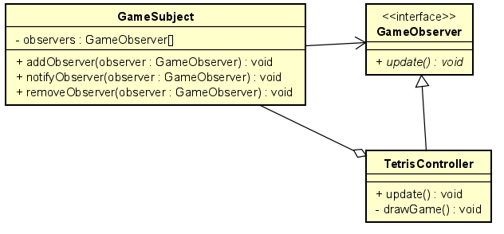

# tetris-pattern

## Diagrammes UML
### _Pattern Factory_

### _Pattern Observer_

### _Pattern State_

## Cas de test

Des cas de test sont disponibles dans le dossier suivant : 

src/test/kotlin/fr/npldev/tetris/

_Pour les réaliser, éxecuter la commande <u>mvn test</u> à la racine du projet ( **./tetris-pattern** )_ 

